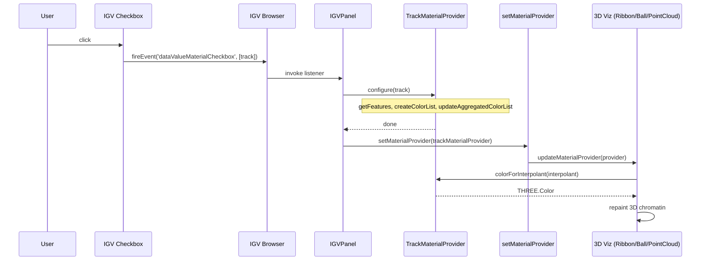

# Architecture: Track Material Provider Checkbox Interaction

This document describes how Spacewalk and the IGV.js spacewalk branch interact via the **track material provider checkbox**—a per-track checkbox in the IGV axis column that enables genomic track data to drive 3D chromatin coloring.

---

## Mermaid Diagram (Component + Sequence)

```mermaid
flowchart TB
    subgraph Spacewalk["Spacewalk"]
        PI[PanelInitializer]
        IGV[IGVPanel]
        TMP[TrackMaterialProvider]
        UTILS[utils.setMaterialProvider]
        VIZ[Ribbon / BallAndStick / PointCloud]
        
        PI -->|creates with colorRamp + trackMaterialProvider| IGV
        IGV -->|browser.on dataValueMaterialCheckbox| EVT[Event Handler]
        EVT -->|checked: activateTrackMaterialProvider| TMP
        EVT -->|unchecked: deactivateTrackMaterialProvider| TMP
        TMP -->|configure / removeTrackInstance| TMP
        IGV -->|setMaterialProvider| UTILS
        UTILS -->|updateMaterialProvider| VIZ
        VIZ -->|colorForInterpolant| TMP
    end
    
    subgraph IGVJS["IGV.js (spacewalk branch)"]
        TV[trackView.createAxis]
        AXIS[.igv-axis-column]
        CB["<input type=checkbox>"]
        BROWSER[browser.fireEvent]
        
        TV -->|append axis div| AXIS
        TV -->|create checkbox for non-ruler/sequence/ideogram| CB
        CB -->|change event| BROWSER
        BROWSER -->|"dataValueMaterialCheckbox [track]"| IGV
    end
    
    USER[User clicks checkbox] --> CB
```





---

## Overview

When a user checks the checkbox next to an IGV track, that track's genomic features (values or colors) are used to color the 3D chromatin structure. Multiple tracks can be active; their colors are blended. The checkbox lives in IGV.js; the logic that responds to it lives in Spacewalk.

---

## Architectural Diagram

```
┌─────────────────────────────────────────────────────────────────────────────────────────┐
│                                    SPACEWALK                                              │
├─────────────────────────────────────────────────────────────────────────────────────────┤
│                                                                                          │
│  ┌──────────────────────┐         ┌─────────────────────────────────────────────────┐   │
│  │   PanelInitializer   │         │              IGVPanel                             │   │
│  │                      │         │                                                  │   │
│  │  Creates IGVPanel     │────────▶│  • colorRampMaterialProvider (default)            │   │
│  │  with:                │         │  • trackMaterialProvider                         │   │
│  │  • colorRampMaterial   │         │  • materialProvider (active: ramp or track)      │   │
│  │  • trackMaterial      │         │                                                  │   │
│  └──────────────────────┘         │  configureMouseHandlers():                        │   │
│                                    │    browser.on('dataValueMaterialCheckbox', ...)   │   │
│                                    │    browser.on('trackremoved', ...)                 │   │
│                                    └────────────────────┬────────────────────────────┘   │
│                                                           │                              │
│                                                           │ subscribes to events          │
│                                                           ▼                              │
│  ┌──────────────────────────────────────────────────────────────────────────────────┐   │
│  │                         IGV.js (spacewalk branch)                                  │   │
│  │                                                                                    │   │
│  │  ┌─────────────────────────────────────────────────────────────────────────────┐   │   │
│  │  │  trackView.js  →  createAxis(browser, track)                                │   │   │
│  │  │                                                                             │   │   │
│  │  │  For each track (except ruler, sequence, ideogram):                          │   │   │
│  │  │    • Create <input type="checkbox"> in axis div                              │   │   │
│  │  │    • Append axis to .igv-axis-column                                         │   │   │
│  │  │    • input.addEventListener('change', () =>                                  │   │   │
│  │  │        browser.fireEvent('dataValueMaterialCheckbox', [this.track])          │   │   │
│  │  │    • trackView.materialProviderInput = input                                 │   │   │
│  │  └─────────────────────────────────────────────────────────────────────────────┘   │   │
│  │                                                                                    │   │
│  │  Layout:  .igv-axis-column  (50px)  contains one axis div per track                │   │
│  │           Each axis: [checkbox] [optional axis canvas]                              │   │
│  └──────────────────────────────────────────────────────────────────────────────────┘   │   │
│                                                           │                              │
│                                                           │ event: dataValueMaterialCheckbox │
│                                                           │ payload: track                │
│                                                           ▼                              │
│  ┌──────────────────────────────────────────────────────────────────────────────────┐   │
│  │  IGVPanel (continued)                                                              │   │
│  │                                                                                    │   │
│  │  On 'dataValueMaterialCheckbox' (track):                                           │   │
│  │    if (track.trackView.materialProviderInput.checked)                               │   │
│  │      → activateTrackMaterialProvider(track)                                        │   │
│  │    else                                                                            │   │
│  │      → deactivateTrackMaterialProvider(track)                                       │   │
│  │                                                                                    │   │
│  │  On 'trackremoved' (track):                                                         │   │
│  │    if (track.trackView.materialProviderInput?.checked)                              │   │
│  │      → removeTrackFromMaterialProvider(track)                                       │   │
│  └──────────────────────────────────────────────────────────────────────────────────┘   │
│                                                           │                              │
│                                                           ▼                              │
│  ┌──────────────────────────────────────────────────────────────────────────────────┐   │
│  │  TrackMaterialProvider (Spacewalk)                                                 │   │
│  │                                                                                    │   │
│  │  configure(track):                                                                 │   │
│  │    • viewport.getFeatures(track, chr, startBP, endBP, bpPerPixel)                  │   │
│  │    • createColorList(allFeaturesPerExtent, track)  // value-based or color-only     │   │
│  │    • trackColorLists.set(trackId, colorList)                                        │   │
│  │    • updateAggregatedColorList()  // blend multiple tracks (LAB space)              │   │
│  │                                                                                    │   │
│  │  removeTrackInstance(track):                                                       │   │
│  │    • Delete from trackColorLists, trackDataRanges                                   │   │
│  │    • updateAggregatedColorList()                                                   │   │
│  │                                                                                    │   │
│  │  colorForInterpolant(t) → THREE.Color  // used by 3D visualization                  │   │
│  └──────────────────────────────────────────────────────────────────────────────────┘   │
│                                                           │                              │
│                                                           │ setMaterialProvider(provider)│
│                                                           ▼                              │
│  ┌──────────────────────────────────────────────────────────────────────────────────┐   │
│  │  utils.js  →  setMaterialProvider(materialProvider)                                │   │
│  │                                                                                    │   │
│  │    ribbon.updateMaterialProvider(materialProvider)                                  │   │
│  │    ballAndStick.updateMaterialProvider(materialProvider)                            │   │
│  │    pointCloud.updateMaterialProvider(materialProvider)                              │   │
│  │    genomicNavigator.repaint()                                                       │   │
│  └──────────────────────────────────────────────────────────────────────────────────┘   │
│                                                           │                              │
│                                                           ▼                              │
│  ┌──────────────────────────────────────────────────────────────────────────────────┐   │
│  │  3D Visualization (Ribbon, BallAndStick, PointCloud)                              │   │
│  │                                                                                    │   │
│  │  Each calls materialProvider.colorForInterpolant(interpolant) for each vertex/     │   │
│  │  instance and updates geometry color attributes → 3D chromatin coloring            │   │
│  └──────────────────────────────────────────────────────────────────────────────────┘   │
│                                                                                          │
└─────────────────────────────────────────────────────────────────────────────────────────┘
```

---

## Sequence Diagram: User Checks a Track Checkbox

```
  User          IGV trackView      IGV browser       IGVPanel         TrackMaterialProvider   setMaterialProvider   3D viz
   │                  │                  │                │                      │                    │               │
   │  click checkbox   │                  │                │                      │                    │               │
   │─────────────────▶│                  │                │                      │                    │               │
   │                  │ change event      │                │                      │                    │               │
   │                  │ fireEvent('dataValueMaterialCheckbox', [track])            │                    │               │
   │                  │─────────────────▶│                │                      │                    │               │
   │                  │                  │  invoke listeners                       │                    │               │
   │                  │                  │────────────────▶│                      │                    │               │
   │                  │                  │                │  activateTrackMaterialProvider(track)        │               │
   │                  │                  │                │  configure(track)      │                    │               │
   │                  │                  │                │──────────────────────▶│                    │               │
   │                  │                  │                │  (viewport.getFeatures, createColorList,    │               │
   │                  │                  │                │   updateAggregatedColorList)                │               │
   │                  │                  │                │◀──────────────────────│                    │               │
   │                  │                  │                │  setMaterialProvider(trackMaterialProvider)│               │
   │                  │                  │                │───────────────────────────────────────────▶│               │
   │                  │                  │                │                      │  ribbon/ball/point   │               │
   │                  │                  │                │                      │  .updateMaterialProvider()          │
   │                  │                  │                │                      │────────────────────────────────────▶│
   │                  │                  │                │                      │                    │  colorForInterpolant()
   │                  │                  │                │                      │                    │  → repaint 3D
   │                  │                  │                │                      │                    │◀───────────────│
   │                  │                  │                │                      │                    │               │
   │  ◀──────────────────────────────────────────────────────────────────────────────────────────────────────────────────
   │  3D chromatin now colored by track data
```

---

## Key Files and Responsibilities

| Component | File | Responsibility |
|-----------|------|----------------|
| **Checkbox creation** | `igv.js/js/trackView.js` | Creates checkbox in `createAxis()`, excludes ruler/sequence/ideogram; fires `dataValueMaterialCheckbox` on change; stores `trackView.materialProviderInput` |
| **Event subscription** | `spacewalk/js/IGVPanel.js` | `browser.on('dataValueMaterialCheckbox', ...)` and `browser.on('trackremoved', ...)` |
| **Track material logic** | `spacewalk/js/trackMaterialProvider.js` | `configure(track)`, `removeTrackInstance(track)`, `colorForInterpolant(t)`, `updateAggregatedColorList()` |
| **Material provider dispatch** | `spacewalk/js/utils/utils.js` | `setMaterialProvider()` updates ribbon, ballAndStick, pointCloud, genomicNavigator |
| **Checkbox clearing** | `spacewalk/js/SceneManager.js` | Calls `unsetDataMaterialProviderCheckbox()` when switching render style (BallAndStick/Ribbon/PointCloud) |
| **Session persistence** | `spacewalk/js/IGVPanel.js` | `getSessionState()` / `restoreSessionState()` for checked track names |

---

## Data Flow Summary

1. **User → IGV**: User toggles checkbox in axis column. IGV fires `dataValueMaterialCheckbox` with the track.
2. **IGV → Spacewalk**: IGVPanel listens and calls `activateTrackMaterialProvider` or `deactivateTrackMaterialProvider`.
3. **TrackMaterialProvider**: Fetches features via `viewport.getFeatures()`, builds color lists, blends them.
4. **Spacewalk 3D**: `setMaterialProvider()` pushes the provider to Ribbon, BallAndStick, PointCloud. Each calls `colorForInterpolant(interpolant)` to color vertices.
5. **Reverse control**: Spacewalk can programmatically set `trackView.materialProviderInput.checked` (e.g. session restore, render-style change) and uses `unsetDataMaterialProviderCheckbox()` to clear all checkboxes when switching visualization modes.

---

## Exclusion Notes

- `materialProviderExclusionTrackTypes`: `['ruler', 'sequence', 'ideogram']` — these tracks do not get a checkbox.
- `canUseTrackForMaterial(track)`: Checks zoom level; if too zoomed out, checkbox is unchecked and track is not added.
