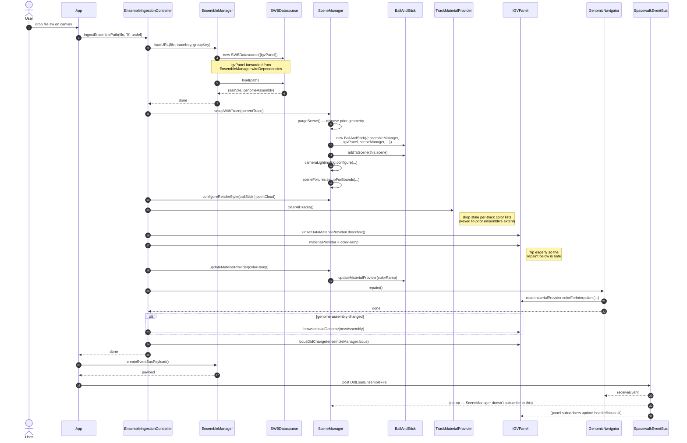

# Runtime sequence — user drops a `.sw` file

A representative end-to-end flow chosen because it exercises most of the wired graph: data loading, scene rebuild, IGV cursor sync, event-bus fan-out. Companion to [`wiring-diagram.md`](./wiring-diagram.md), which shows how these objects were assembled.

**Conventions:**
- Solid arrows are direct method calls.
- Dashed arrows are returns.
- `Bus` is the global `SpacewalkEventBus` — broadcast messages are shown as arrows to it.

## What this sequence is saying

- **The orchestrator stays thin.** `App` only routes the drop event to `EnsembleIngestionController` and posts the final event — it does not micromanage the loaders, scene, or panels.
- **Ingestion is a single coordinator.** `EnsembleIngestionController` (extracted from `SceneManager` in Phase 3a) owns the cross-cutting "load + rebuild + sync UI" choreography. Before extraction, this logic was scattered across `SceneManager` and made it the largest file in the repo.
- **Material-provider flip is eager, not event-driven.** Step 13 (`igvPanel.materialProvider = colorRamp`) used to happen via the `DidLoadEnsembleFile` event handler in `GenomicNavigator`, which fires *after* this method returns — but step 16 (`GN.repaint`) needs the flip to have happened, so we do it eagerly. This is one of the fixes from PR #45 and the comment is in the code.
- **Datasource is per-file.** `SWBDatasource` is constructed fresh on every load (step 4), not held as a singleton. `EnsembleManager` forwards `igvPanel` to each new instance via the late-bound wiring shown in the wiring diagram.

## What this sequence is **not**

- Not exhaustive — render-loop frames, IGV's internal track loads, and Juicebox locus sync are out of scope.
- Not the error path — `try/catch/finally` around `purgeScene()` and `isLoading` flag toggling is in the code but omitted for clarity.
- Not the session-load path — `SessionService.loadSession()` is a different sequence (orchestrates `EIC` + `juiceboxPanel.loadSession` + `loadIGVSession`).

## Where this flow can be invoked

The same `EIC.ingestEnsemblePath(...)` call is the entry point for **four** user actions:
1. Drag-and-drop (this diagram)
2. URL param `?file=...` (`App.consumeURLParams`)
3. `swtool` postMessage (`App.initializePostMessageListener`)
4. File-load modal selections (`spacewalkFileLoadWidgetServices` via the `fileLoader.load` callback wired in `UIBootstrapper`)

That single entry point is the post-Phase-3 payoff — before DI, each of those paths read singletons differently and the variations were hard to keep in sync.
