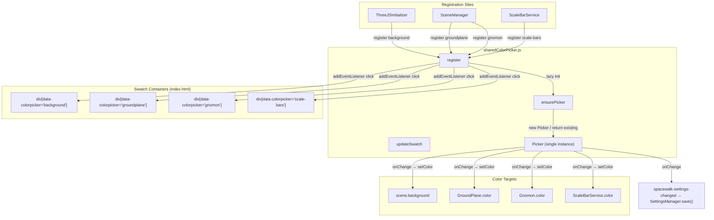
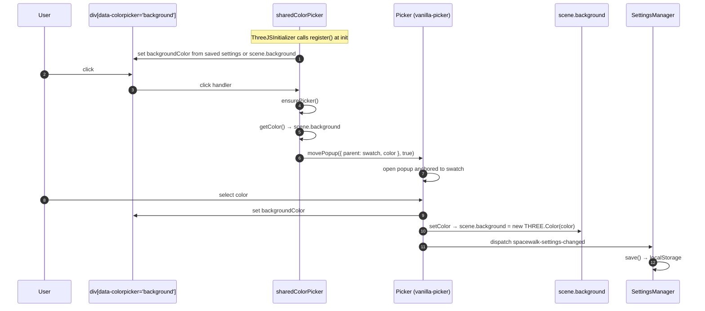
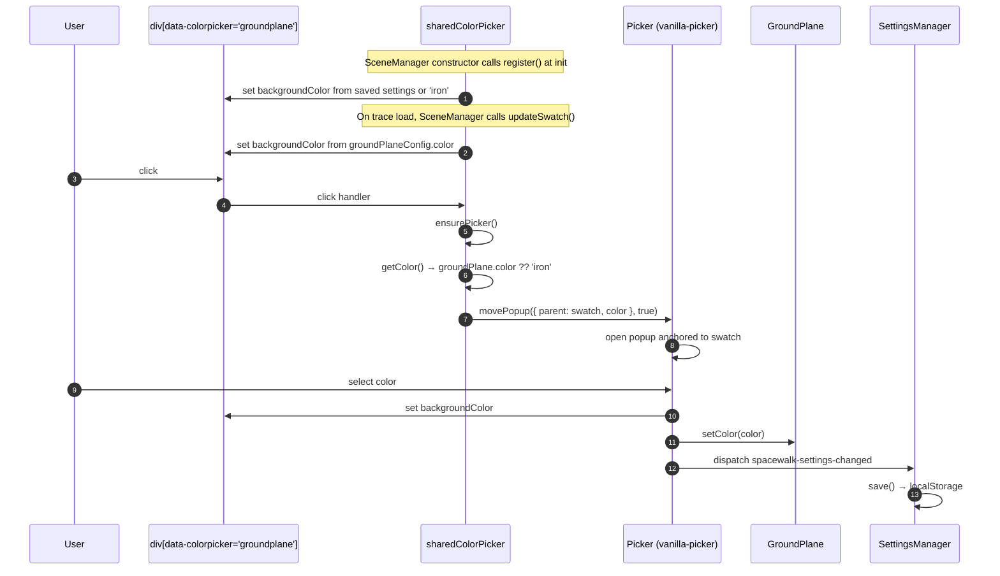
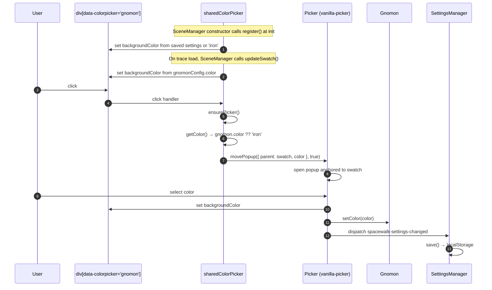
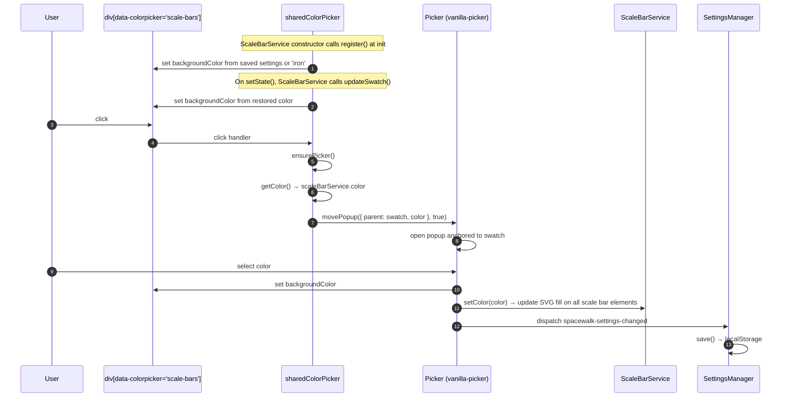
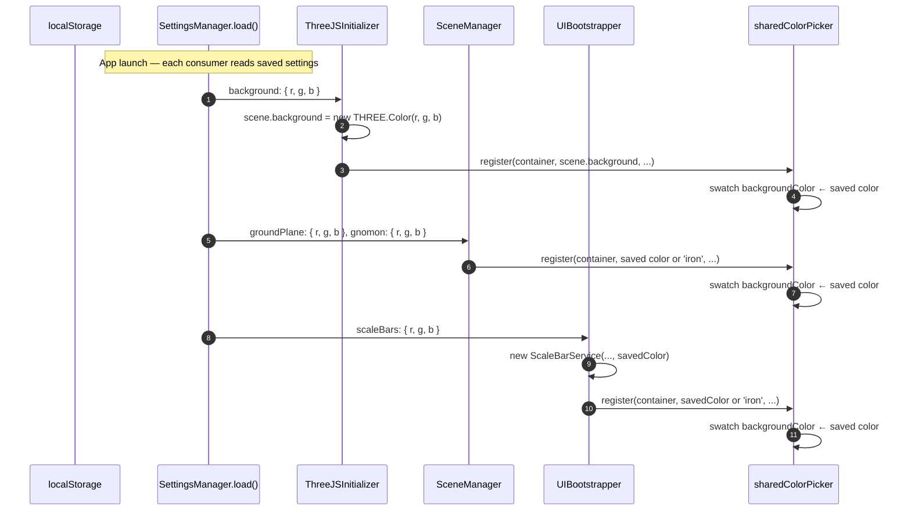

# Shared Color Picker — Interaction Diagrams

A single `vanilla-picker` instance is shared across four color swatches (background, gnomon, ground plane, scale bars). The picker is created lazily on first click and re-targeted via `movePopup()` to whichever swatch the user activates.

---

## 1. Architecture

### Key Points

| Aspect | Detail |
|--------|--------|
| **Single instance** | One `Picker`, created lazily by `ensurePicker()` on first swatch click |
| **Re-targeting** | `picker.movePopup({ parent, color }, true)` re-parents and opens the popup |
| **Initial swatch color** | Derived from saved settings (localStorage) or default (`appleCrayonColorThreeJS('iron')`) |
| **getColor (lazy)** | Called only on click — reads live color from the scene object |
| **Settings persistence** | `onChange` dispatches `spacewalk-settings-changed`; `SettingsManager` listens and saves to localStorage |

---

## 2. Background — Sequence

---

## 3. Ground Plane — Sequence

---

## 4. Gnomon — Sequence

---

## 5. Scale Bars — Sequence

---

## 6. Settings Restore — Sequence

