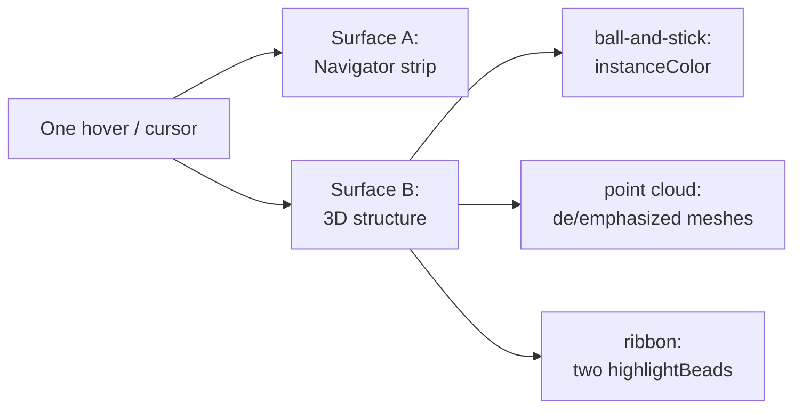
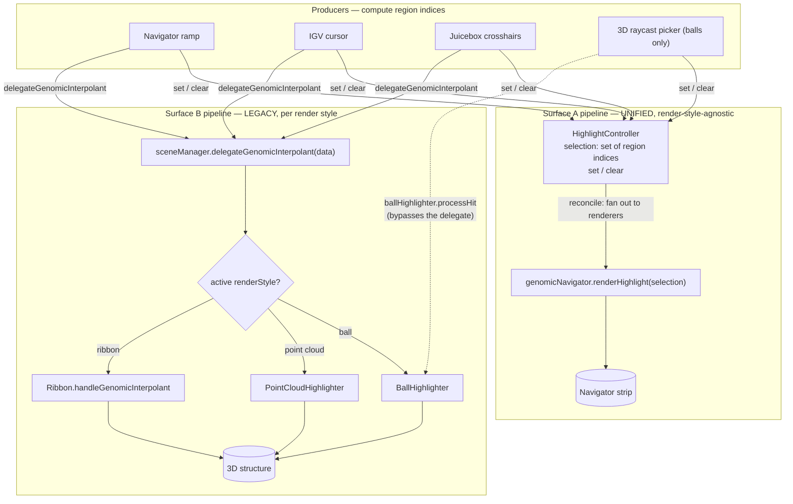
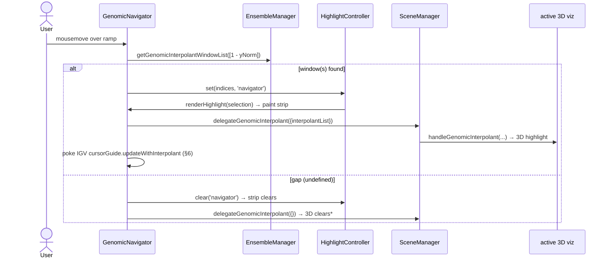
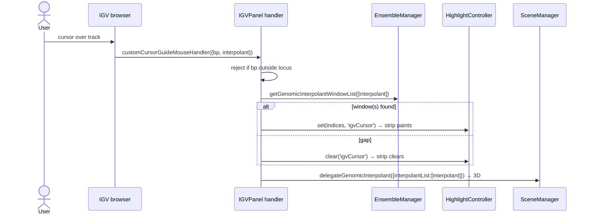
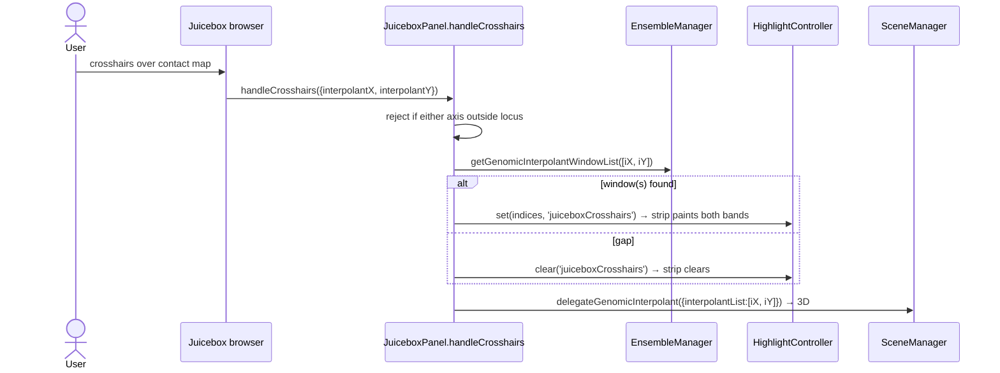
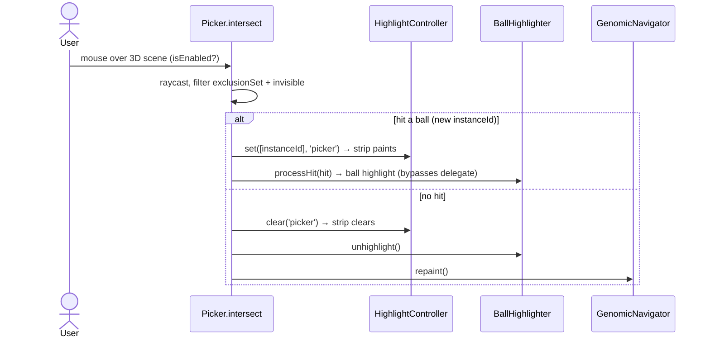
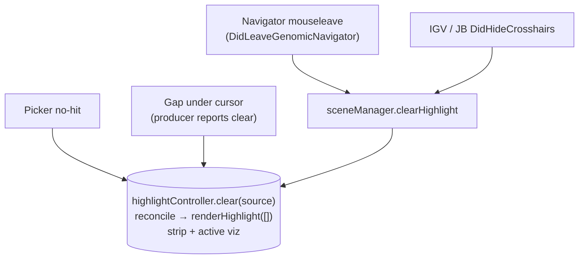

# Highlighting — participants, surfaces, and flows

> **STATUS: Being reconciled mid-migration.** Originally written after the highlighting redesign
> Phases 1–3 ([refactor-highlighting-redesign.md](refactor-highlighting-redesign.md), PR #65).
> Since then, three further changes have landed: (1) **Surface B unification** (PR #66) — the 3D
> vizzes now render the shared selection via `renderHighlight(selection)` and
> `delegateGenomicInterpolant` is deleted; (2) **IGV producer rebuilt** (PR #66) — spacewalk owns the
> IGV cursor guide and highlight producer ([`igvCursorGuide.js`](../src/igvCursorGuide.js)) instead of
> igv's internal cursor guide, which is unreliable under our config in igv v3.8.0; (3) **clear-path
> collapse** — the per-style *clear* routers `delegateLeaveGenomicNavigator` / `delegateHideCrosshairs`
> and the per-viz `handle*` clear methods are gone, replaced by one `sceneManager.clearHighlight()`
> (see §5, now reconciled).
>
> §1–§2, the **"Directionality — drivers and receivers"** section, and §5 are current. The §3 spine
> and §4 sequence sections still depict the pre-unification *set* routing
> (`delegateGenomicInterpolant`) and get a reconciliation pass with the next phase (event-bus Phase 3:
> dissolving `DidEnter/LeaveGenomicNavigator` + `picker.isEnabled`). This is the *map* — the cast of
> participants and the paths a highlight takes.

Highlighting is the most multifaceted interaction in Spacewalk. The complexity is combinatorial:
**two different things get highlighted, four different inputs can drive a highlight, and the 3D
structure highlight has three render-style-specific implementations.** A naïve "interaction diagram"
of any one path hides the fact that the same user intent ("light up region 7") arrives from four
directions and lands on two surfaces by two very different mechanisms.

This document separates those concerns: first the **surfaces** (what lights up), then the
**producers** (what drives it), then the **spine** that connects them, then a **walkthrough of each
of the four input styles**, and finally the **clear paths** — which are where the subtlety actually
lives.

---

## 1. Two surfaces get highlighted

A single hover lights up *two independent things*. Keeping them distinct is the key to the whole
picture, because — after the redesign — they travel completely different roads.

| Surface | What it is | Who paints it | Render-style-aware? |
|---|---|---|---|
| **A — Navigator strip** | The colored band drawn on the color-ramp canvas (`#spacewalk_color_ramp_canvas_highlight` / `highlight_ctx`) in the genomic navigator | `genomicNavigator.renderHighlight(selection)`, the **sole** registered renderer on `HighlightController` | **No** — one code path for every style |
| **B — 3D structure** | The highlighted geometry in the 3D view | One of three highlighters, chosen by render style (below) | **Yes** — three separate implementations |

The three flavors of Surface B:

| Render style | Highlighter | Highlight does | Clear (`unhighlight`) does |
|---|---|---|---|
| ball-and-stick | `BallHighlighter` | writes `highlightColor` into the balls' `instanceColor` for the hit `instanceId`s | repaints those instances from the material provider |
| point cloud | `PointCloudHighlighter` | swaps **all** meshes to the deemphasized material, then re-emphasizes the selected meshes | repaints all meshes from the material provider |
| ribbon | `Ribbon` (no highlighter object) | moves two pre-made `highlightBeads` spheres onto the curve at the hovered interpolant(s) and shows them | hides the two beads |

> **The bug we just fixed lived in Surface A.** Before the redesign the strip had *no owner* — it
> was repainted as a side effect of whichever Surface-B highlighter happened to call back into the
> navigator. That worked in ribbon (navigator self-painted) and ball (the highlighter reached back)
> and **silently failed in point cloud** (its highlighter had no navigator reference). The redesign
> made Surface A a first-class renderer of a shared selection, so it now tracks for every style.

---

## 2. Four producers drive a highlight

Each input is a **producer**: it converts a pointer position into a set of *region indices*
(positions in the current genomic-extent list) and reports them. All four speak the same first
language — a genomic **interpolant** in `[0,1]` — which `ensembleManager.getGenomicInterpolantWindowList`
turns into `{ genomicExtent, index }` windows (or `undefined` for a gap).

| Producer | Site | Trigger → what it computes | Note |
|---|---|---|---|
| **Navigator ramp** | `genomicNavigator.onCanvasMouseMove` | mouse-Y on the ramp → one interpolant `1 - yNorm` → indices | — |
| **IGV pointer** | `igvCursorGuide.js` (own `mousemove` on the IGV column container) | pointer x → bp (`refFrame.start + x·bpPerPixel`) → region index (direct `startBP..endBP` lookup) | spacewalk-owned; also draws its own continuous guide line (§6) |
| **Juicebox crosshairs** | `juiceboxPanel.handleCrosshairs` | crosshair x,y on the contact map → **two** interpolants | the only producer that yields two regions at once |
| **3D raycast picker** | `picker.intersect` | ray from the mouse into the scene → a hit `instanceId` | **balls only** — point cloud, ribbon, stick are in the raycaster `exclusionSet` |

> **Asymmetry to remember:** direct 3D interaction (the picker) only fires in **ball-and-stick**
> mode. You cannot click-highlight a point-cloud point or a ribbon segment — those object names are
> excluded from the raycast. The other three producers work in all three render styles.

---

## Directionality — drivers and receivers

A producer is a **driver** (it writes the shared selection); a surface that reflects the selection
is a **receiver**. Most confusion about highlighting dissolves once you see which participants are
which — and that the relationship is deliberately **not symmetric**.

| Participant | Drives the selection? | Reflects the selection? |
|---|---|---|
| **Navigator** | yes — ramp hover | yes — strip |
| **IGV panel** | yes — pointer → region | **no** — its guide line is its own continuous locator (`igvCursorGuide.js`), not a selection renderer |
| **Juicebox** | yes — crosshairs → two regions | **no** — the crosshair is its own UI |
| **3D structure** | yes — *ball picker only* | yes — the active viz renders the selection |

Reading the asymmetry:

- **Navigator is the only bidirectional participant** — it both drives (ramp) and reflects (strip),
  so 3D interaction lights up the strip and a ramp hover lights up the structure.
- **IGV and Juicebox are one-way drivers.** They push into the strip + 3D structure; nothing pushes
  back into them. That is exactly why the IGV guide line is driven by IGV's *own* pointer rather
  than the shared selection — it is a locator for its own input, not a mirror of another producer's.
  (It is also why a coarse genomic strip must not quantize the line: the line is continuous, the
  highlight is the discrete region the pointer lands in.)
- **3D interaction is non-reciprocal.** Hovering a ball drives the strip + the ball; in point cloud
  there is no direct interaction at all (the picker excludes it), so its highlight only ever arrives
  *via* a driver. Nothing from the 3D viewer is broadcast to IGV or juicebox — and the consistency
  argument is the tell: if 3D→IGV existed you would expect 3D→juicebox, and it does not, so neither
  should.
- **The 1D↔3D linkage is preserved by IGV-as-driver:** IGV (1D genomic space) drives the 3D
  structure through the shared selection. Only the reverse line-mirroring is (correctly) absent.

---

## 3. The spine — one selection for the strip, per-style delegation for the structure

This is the heart of the design, and the place where "what's done" and "what's deferred" diverge.
Every producer fans out to **both** pipelines:

Read the diagram as two columns hanging off the same four producers:

- **Surface A (left) is the redesign's finished half.** Every producer calls
  `highlightController.set(indices, source)` or `.clear(source)`. The controller dedupes, diffs, and
  on change `reconcile()`s by handing the selection to every registered renderer. Today there is
  exactly one renderer — the navigator strip — and the **render-style switch does not exist on this
  path at all**. Navigator and IGV and Juicebox and picker traverse the *identical* code to paint
  the strip, which is precisely why they can no longer disagree by render style.

- **Surface B (right) is still the legacy tangle.** Producers call
  `sceneManager.delegateGenomicInterpolant(data)`, which switches on the active render style and
  forwards to that viz's `handleGenomicInterpolant(data)`, which drives its highlighter. The picker
  is the odd one out: it **bypasses the delegate** and pokes `ballHighlighter` directly (it already
  knows it's in ball mode, since only balls are hittable).

> **Mental model:** the strip is now "one state, one renderer." The structure is still "one router,
> three implementations, plus a picker side-door." The deferred work in the RFC is to make Surface B
> look like Surface A — each viz becomes a `renderHighlight(selection)` renderer on the same
> controller, and `delegateGenomicInterpolant` + the switch dissolve.

A note on **`genomicNavigator.repaint()`**, which appears in several flows below: it is *not* part of
the selection pipeline. It redraws the color ramp itself (and incidentally clears the strip canvas).
It fires on trace/colormap/ensemble changes and as a belt-and-suspenders strip clear. Don't confuse
it with `renderHighlight([])`, which is the selection pipeline's way of clearing the strip.

---

## 4. The four highlighting styles, walked end to end

Each subsection is one of the user-facing "styles" of highlighting — the same outcome reached from a
different input. Sequence diagrams show the **set** (hover) path; clears are collected in §5.

### 4a. Driven by the genomic navigator — *the bug we just fixed*

Mousing the color ramp. This is the path that was broken in point-cloud mode.

\* *ribbon does **not** clear on the empty delegate — see §5.* The strip clears correctly either way
because `clear('navigator')` runs the unified pipeline. **Before the redesign**, the strip half of
this flow only existed in ribbon (self-paint) and ball (highlighter back-call); point cloud reached
the 3D structure fine but never painted the strip. That gap is what Phase 2 closed.

### 4b. Driven by the IGV panel cursor

Mousing a genomic track in the embedded IGV browser.

Structurally identical to the navigator path on the strip side — same `set`/`clear`, same renderer.
This sameness *is* the fix: the navigator and IGV can no longer diverge by render style.

### 4c. Driven by the Juicebox crosshairs

Mousing the contact map. Unique in producing **two** regions (the x and y of the crosshair).

The two interpolants flow through unchanged: the strip paints two bands, ball/point-cloud highlight
two regions, and ribbon's two `highlightBeads` are exactly why there are *two* of them.

### 4d. Driven by direct 3D interaction (the raycast picker)

Hovering the 3D model itself. **Ball-and-stick only** — the picker excludes point-cloud, ribbon, and
stick geometry from the raycast.

This is the one producer whose two pipelines are wired differently: it pushes the strip through the
controller like everyone else, but reaches the ball highlighter **directly** rather than through
`delegateGenomicInterpolant`. The picker is also gated by `isEnabled`, toggled by the navigator
enter/leave events (§6).

The fact that direct 3D hover now paints the strip (via `set([instanceId])`) is itself a redesign
win — it used to ride the same fragile back-call as the navigator-driven ball highlight.

---

## 5. Clearing (now uniform)

Clearing *used* to be the subtle part — an asymmetric per-(input × style) matrix of `delegate*`
routers and per-viz `handle*` methods, with holes where a viz could get stuck highlighted. **That
matrix has been collapsed.** Every path that ends a highlight now calls
`sceneManager.clearHighlight(source)` → `highlightController.clear(source)`, the controller runs
`renderHighlight([])` on every registered renderer, and **both surfaces clear identically** — the
navigator strip and the active 3D viz, through the exact same pipeline as a *set*. The render-style
switch lives in one place (`getActiveVisualization()`); inactive vizzes are already hidden by
`configureRenderStyle()`, so there is nothing per-style left to route.

| Clear trigger | Path | Result |
|---|---|---|
| Navigator mouseleave (`DidLeaveGenomicNavigator`) | `sceneManager.clearHighlight('leaveNavigator')` | strip + active viz clear via reconcile |
| IGV / Juicebox cursor hide (`DidHideCrosshairs`) | `sceneManager.clearHighlight('hideCrosshairs')` | strip + active viz clear via reconcile |
| Picker no-hit (raycast misses) | `highlightController.clear('picker')` | strip + active viz clear via reconcile |
| Gap under a still-hovering cursor | producer reports `clear` (undefined window) | strip + active viz clear via reconcile |

The old `delegateHideCrosshairs` / `delegateLeaveGenomicNavigator` routers and the per-viz
`handleHideCrosshairs` / `handleHideHighlights` / `handleLeaveGenomicNavigator` methods are **gone** —
`renderHighlight([])` subsumes all of them.

**One wrinkle remains, slated for the next phase (event-bus Phase 3).** The picker still toggles
`picker.isEnabled` and calls `ballHighlighter.unhighlight()` directly on
`DidEnter/LeaveGenomicNavigator`. The unhighlight is now redundant with the reconcile clear; the
`isEnabled` gate — suppress 3D raycast picking while the cursor is over a 1D producer — is the real
remaining behavior. Dissolving `DidEnter/LeaveGenomicNavigator` into producers and retiring
`isEnabled` is the remaining cleanup.

---

## 6. Cross-participant coupling (the non-obvious edges)

A few edges don't fit the clean producer→pipeline story and are worth calling out so they aren't
mistaken for bugs:

- **The IGV cursor guide is spacewalk-owned and continuous.** `igvCursorGuide.js` draws its own
  vertical line that follows the IGV pointer continuously (from raw bp), independent of the discrete
  shared selection — so it is *not* a selection renderer and other producers do not move it (see
  "Directionality"). This replaced a *dead* call into `cursorGuide.updateWithInterpolant`, a method
  that does not exist in upstream igv v3.8.0, so mousing the ramp never actually moved the IGV line.
- **`DidEnter` / `DidLeaveGenomicNavigator` gate the picker.** These two events exist mainly to set
  `picker.isEnabled` (don't raycast the 3D model while the user is working the ramp) and to clear the
  ball highlighter on the boundary. The redesign folds these into ordinary producer state, which is
  why event-bus Phase 3 is *subsumed* by the highlighting RFC.
- **The old IGV HMR footgun is gone.** The IGV producer no longer registers a once-at-init closure
  on igv's internal cursor guide. `igvCursorGuide.attach()` uses an `AbortController` and is
  re-attached on every `configureMouseHandlers` (browser create / session restore), so it survives
  IGV DOM rebuilds without a full page reload.

---

## 7. Gaps in the genomic extent (a constraint every producer honors)

An ensemble's genomic extent can have **gaps** — stretches with no region (data absent, or a defect
deliberately ignored). This is independent of render style. The contract:

- **Producer side:** an interpolant that lands in a gap makes `getGenomicInterpolantWindowList`
  return `undefined`. Every producer treats that as an explicit **`clear()`**, never a degenerate
  `set([])`. Hovering a gap highlights nothing; it does not throw and does not highlight a neighbor.
- **Renderer side:** because the selection holds *indices*, `renderHighlight(selection)` maps
  `index → genomicExtentList[index]` and `.filter(Boolean)`s indices it has no extent for. The 3D
  highlighters apply the same tolerance when mapping `index → mesh / instanceId / curve point`.

See the RFC's "Constraint: gaps in the genomic extent" section for the deeper rationale.

---

## 8. Where this is going

| Half | State | Shape |
|---|---|---|
| **Surface A — navigator strip** | ✅ Done (Phases 1–3) | One observable selection → one reconciler → one renderer. No render-style switch on this path. |
| **Surface B — 3D structure** | ⚠️ Legacy | Per-style `delegateGenomicInterpolant` switch + three highlighters + a picker side-door + the split clear-paths in §5. |

The target (deferred, not bug-driven — see the RFC's "Phase 3 deferred" section) is to make Surface B
look like Surface A: each viz registers a `renderHighlight(selection)` renderer on the same
`HighlightController`, the producers stop calling `delegateGenomicInterpolant`, and
`delegateGenomicInterpolant` / `delegateLeaveGenomicNavigator` / `delegateHideCrosshairs`, the
standalone highlighter mutators, the `DidEnter/LeaveGenomicNavigator` events, `picker.isEnabled`, and
the `point_cloud` raycast exclusion all dissolve. At that point the §5 clear matrix disappears
entirely — there is one path, four producers wide and N renderers deep, and nothing left to wire
wrong.

---

## See also

- [refactor-highlighting-redesign.md](refactor-highlighting-redesign.md) — the RFC / plan this map documents the result of (PR #65).
- [architecture/wiring-diagram.md](architecture/wiring-diagram.md) — how these participants are assembled and injected.
- [interaction-diagram-spacewalk-igv.md](interaction-diagram-spacewalk-igv.md) — the IGV cursor-guide edge in more detail.
- [interaction-diagram-spacewalk-juicebox.md](interaction-diagram-spacewalk-juicebox.md) — the Juicebox crosshairs edge in more detail.
