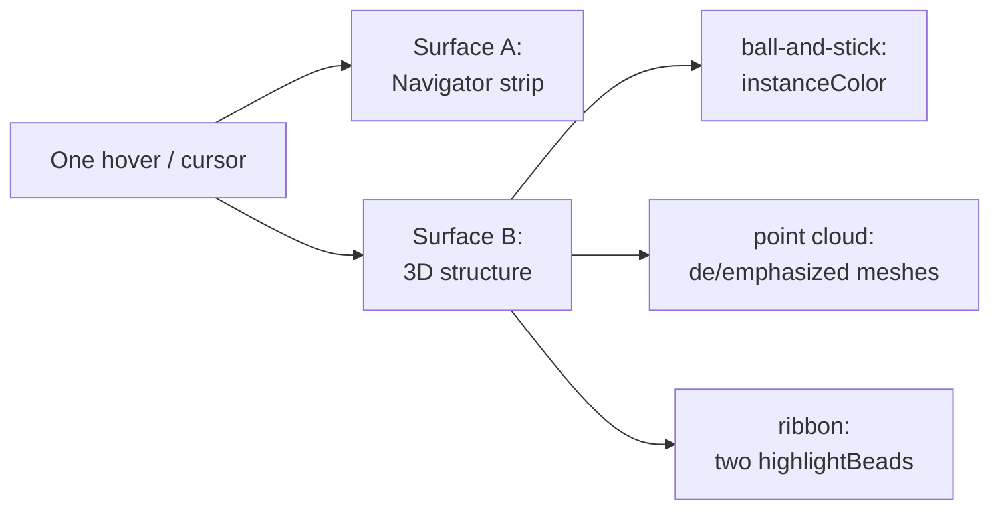
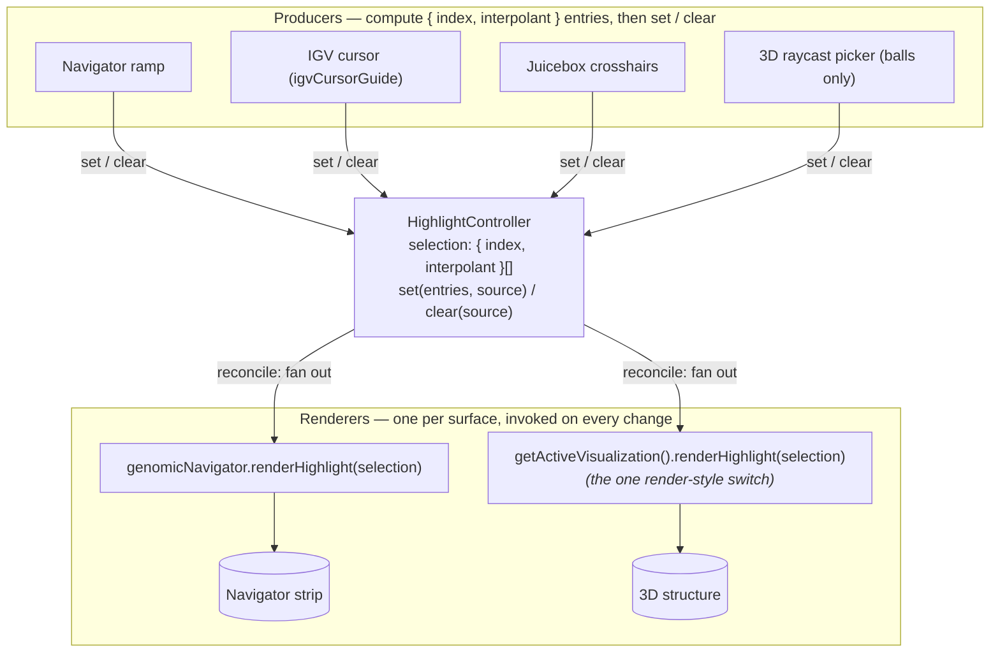
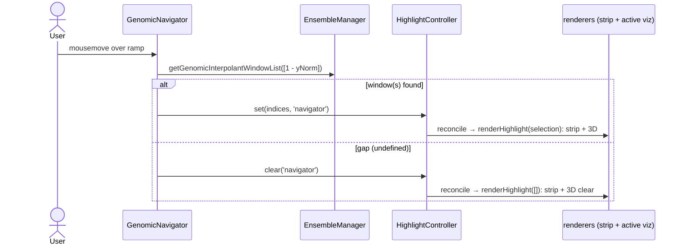
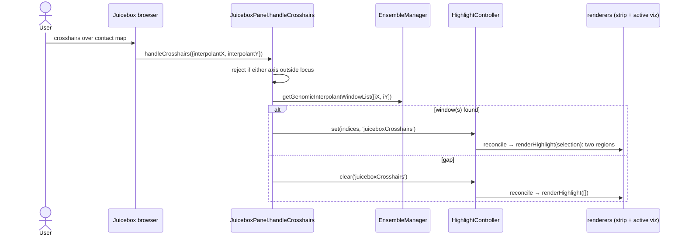
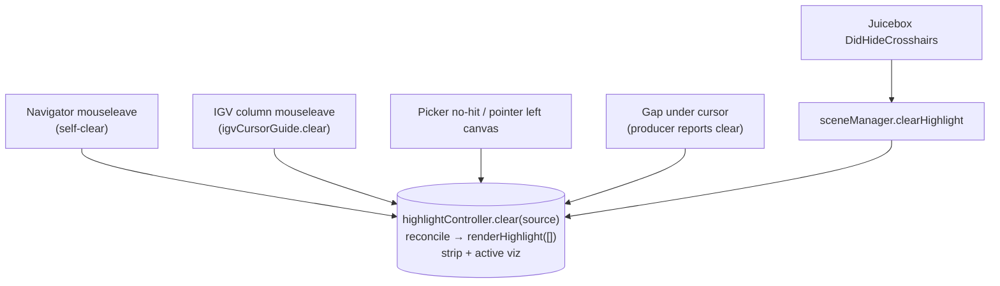

# Highlighting — participants, surfaces, and flows

> **STATUS: Current.** The highlighting redesign ([refactor-highlighting-redesign.md](refactor-highlighting-redesign.md))
> is complete and this map reflects the shipped code. The arc: Phases 1–3 (PR #65) built the unified
> selection for the strip; PR #66 unified Surface B (3D vizzes became `renderHighlight(selection)`
> renderers, `delegateGenomicInterpolant` deleted) and rebuilt the IGV producer as a spacewalk-owned
> cursor guide ([`igvCursorGuide.js`](../src/igvCursorGuide.js), since igv v3.8.0's internal guide is
> unreliable under our config); PR #68 collapsed the per-style *clear* routers into one
> `sceneManager.clearHighlight()`; the final PR dissolved the `DidEnter/LeaveGenomicNavigator` events
> and retired `picker.isEnabled` (the picker now gates on cursor-over-canvas). The end state the RFC
> targeted — **one state, many writers, one renderer per surface** — is reached. This is the *map*:
> the cast of participants and the paths a highlight takes.
>
> **Follow-on shipped (PR #70, continuous genomic locator).** The selection entry is now
> `{ index, interpolant }`: the discrete `index` drives the quantized surfaces, and a **continuous**
> `interpolant` ∈ [0,1] drives the ribbon bead so it glides along the curve instead of hopping
> window-to-window. The conceit: *navigation* is continuous, the *data* is discrete, the index is a
> projection of the continuous coordinate. See
> [refactor-continuous-genomic-locator.md](refactor-continuous-genomic-locator.md) and §3/§4b/§7 below.

Highlighting is the most multifaceted interaction in Spacewalk. The complexity is combinatorial:
**two different things get highlighted, four different inputs can drive a highlight, and the 3D
structure has three render styles.** The same user intent ("light up region 7") arrives from four
directions and lands on two surfaces — but, after the redesign, through **one** mechanism: every
input is a pure writer to a single selection, and one reconciler fans that selection out to one
renderer per surface, with the render-style switch living in exactly one place.

This document separates those concerns: first the **surfaces** (what lights up), then the
**producers** (what drives it), then the **spine** that connects them, then a **walkthrough of each
of the four input styles**, and finally the **clear paths**.

---

## 1. Two surfaces get highlighted

A single hover lights up *two independent things*. Keeping them distinct is the key to the whole
picture, because — after the redesign — they travel completely different roads.



| Surface | What it is | Who paints it | Render-style-aware? |
|---|---|---|---|
| **A — Navigator strip** | The colored band drawn on the color-ramp canvas (`#spacewalk_color_ramp_canvas_highlight` / `highlight_ctx`) in the genomic navigator | `genomicNavigator.renderHighlight(selection)`, the **sole** registered renderer on `HighlightController` | **No** — one code path for every style |
| **B — 3D structure** | The highlighted geometry in the 3D view | One of three highlighters, chosen by render style (below) | **Yes** — three separate implementations |

The three flavors of Surface B:

| Render style | Highlighter | Highlight does | Clear (`unhighlight`) does |
|---|---|---|---|
| ball-and-stick | `BallHighlighter` | writes `highlightColor` into the balls' `instanceColor` for the hit `instanceId`s | repaints those instances from the material provider |
| point cloud | `PointCloudHighlighter` | swaps **all** meshes to the deemphasized material, then re-emphasizes the selected meshes | repaints all meshes from the material provider |
| ribbon | `Ribbon` (no highlighter object) | moves two pre-made `highlightBeads` spheres onto the curve at the hovered **continuous interpolant(s)** (`curve.getPointAt`) and shows them — the bead *glides* | hides the two beads |

> **Discrete highlight vs. continuous locator (PR #70).** The ribbon bead is not really a *highlight*
> of a discrete window — it is a continuous **locator**, the 3D analogue of IGV's continuous guide
> line. So a selection entry carries both an `index` (discrete; drives the strip band, the lit ball,
> the point-cloud subset) and an `interpolant` (continuous; drives the bead). Only the bead reads the
> interpolant; the band and the ball stay quantized to the window, because there is no fractional
> region to color.

> **The bug we just fixed lived in Surface A.** Before the redesign the strip had *no owner* — it
> was repainted as a side effect of whichever Surface-B highlighter happened to call back into the
> navigator. That worked in ribbon (navigator self-painted) and ball (the highlighter reached back)
> and **silently failed in point cloud** (its highlighter had no navigator reference). The redesign
> made Surface A a first-class renderer of a shared selection, so it now tracks for every style.

---

## 2. Four producers drive a highlight

Each input is a **producer**: it converts a pointer position into a set of *region indices*
(positions in the current genomic-extent list) and reports them. All four speak the same first
language — a genomic **interpolant** in `[0,1]` — which `ensembleManager.getGenomicInterpolantWindowList`
turns into `{ genomicExtent, index }` windows (or `undefined` for a gap).

| Producer | Site | Trigger → what it computes | Note |
|---|---|---|---|
| **Navigator ramp** | `genomicNavigator.onCanvasMouseMove` | mouse-Y on the ramp → one interpolant `1 - yNorm` → indices | — |
| **IGV pointer** | `igvCursorGuide.js` (own `mousemove` on the IGV column container) | pointer x → bp (`refFrame.start + x·bpPerPixel`) → region index (direct `startBP..endBP` lookup) | spacewalk-owned; also draws its own continuous guide line (§6) |
| **Juicebox crosshairs** | `juiceboxPanel.handleCrosshairs` | crosshair x,y on the contact map → **two** interpolants | the only producer that yields two regions at once |
| **3D raycast picker** | `picker.intersect` | ray from the mouse into the scene → a hit `instanceId` | **balls only** — point cloud, ribbon, stick are in the raycaster `exclusionSet` |

> **Asymmetry to remember:** direct 3D interaction (the picker) only fires in **ball-and-stick**
> mode. You cannot click-highlight a point-cloud point or a ribbon segment — those object names are
> excluded from the raycast. The other three producers work in all three render styles.

---

## Directionality — drivers and receivers

A producer is a **driver** (it writes the shared selection); a surface that reflects the selection
is a **receiver**. Most confusion about highlighting dissolves once you see which participants are
which — and that the relationship is deliberately **not symmetric**.

| Participant | Drives the selection? | Reflects the selection? |
|---|---|---|
| **Navigator** | yes — ramp hover | yes — strip |
| **IGV panel** | yes — pointer → region | **no** — its guide line is its own continuous locator (`igvCursorGuide.js`), not a selection renderer |
| **Juicebox** | yes — crosshairs → two regions | **no** — the crosshair is its own UI |
| **3D structure** | yes — *ball picker only* | yes — the active viz renders the selection |

Reading the asymmetry:

- **Navigator is the only bidirectional participant** — it both drives (ramp) and reflects (strip),
  so 3D interaction lights up the strip and a ramp hover lights up the structure.
- **IGV and Juicebox are one-way drivers.** They push into the strip + 3D structure; nothing pushes
  back into them. That is exactly why the IGV guide line is driven by IGV's *own* pointer rather
  than the shared selection — it is a locator for its own input, not a mirror of another producer's.
  (It is also why a coarse genomic strip must not quantize the line: the line is continuous, the
  highlight is the discrete region the pointer lands in.)
- **3D interaction is non-reciprocal.** Hovering a ball drives the strip + the ball; in point cloud
  there is no direct interaction at all (the picker excludes it), so its highlight only ever arrives
  *via* a driver. Nothing from the 3D viewer is broadcast to IGV or juicebox — and the consistency
  argument is the tell: if 3D→IGV existed you would expect 3D→juicebox, and it does not, so neither
  should.
- **The 1D↔3D linkage is preserved by IGV-as-driver:** IGV (1D genomic space) drives the 3D
  structure through the shared selection. Only the reverse line-mirroring is (correctly) absent.

---

## 3. The spine — one selection, many writers, one renderer per surface

This is the heart of the design. Every producer is a pure **writer** to a single selection; one
**reconciler** fans that selection out to a renderer for each surface:



Read it as four producers feeding one controller, which feeds one renderer per surface:

- **Producers only `set`/`clear`.** Each computes `{ index, interpolant }` entries and calls
  `highlightController.set(entries, source)` or `.clear(source)`. None of them knows the render
  style, touches a highlighter, or paints anything. The picker is no longer special — it writes the
  same way (it used to reach `ballHighlighter` through a side-door; that's gone). The continuous
  producers (navigator, IGV, juicebox) report their real interpolant; the discrete picker reports the
  picked window's center.
- **The controller diffs and fans out.** On a real change (index *or* interpolant differs) it
  `reconcile()`s by handing the selection to every registered renderer.
- **Two renderers, registered in `sceneManager.createHighlighters`:** the navigator strip
  (`genomicNavigator.renderHighlight`) and the active 3D viz
  (`getActiveVisualization()?.renderHighlight`). **The render-style switch exists in exactly one
  place** — `getActiveVisualization()` — and inactive vizzes are hidden by `configureRenderStyle()`,
  so only the active one ever renders. Every producer traverses this identical path, which is
  precisely why they can no longer disagree by render style.

> **Mental model:** one state, many writers, one renderer per surface. There is no Surface A/B split,
> no `delegateGenomicInterpolant`, no per-viz `handle*` routers, no picker side-door. Clearing is the
> same path with an empty selection (§5).

A note on **`genomicNavigator.repaint()`**, which appears in several flows below: it is *not* part of
the selection pipeline. It redraws the color ramp itself (and incidentally clears the strip canvas).
It fires on trace/colormap/ensemble changes and as a belt-and-suspenders strip clear. Don't confuse
it with `renderHighlight([])`, which is the selection pipeline's way of clearing the strip.

---

## 4. The four highlighting styles, walked end to end

Each subsection is one of the user-facing "styles" of highlighting — the same outcome reached from a
different input. Sequence diagrams show the **set** (hover) path; clears are collected in §5.

### 4a. Driven by the genomic navigator — *the bug we just fixed*

Mousing the color ramp. This is the path that was broken in point-cloud mode.



Both surfaces light up (or clear) through the same reconcile. **Before the redesign**, the strip half
of this flow only existed in ribbon (self-paint) and ball (highlighter back-call); point cloud
reached the 3D structure fine but never painted the strip — that gap (Phases 1–2) was the original
motivating bug. Today there is nothing render-style-specific on either surface's path.

### 4b. Driven by the IGV panel cursor

Mousing a genomic track in the embedded IGV browser.

```mermaid
%%{init: {'themeVariables': {'fontSize': '16px', 'fontFamily': 'arial'}}}%%
sequenceDiagram
    actor U as User
    participant IGV as IGV column
    participant CG as igvCursorGuide
    participant EM as EnsembleManager
    participant HC as HighlightController
    participant R as renderers (strip + active viz)
    U->>IGV: cursor over track lane
    IGV->>CG: mousemove
    CG->>CG: move continuous guide line (raw bp); reject if outside lane
    CG->>EM: locatorForBP(bp) via genomicExtentList
    alt inside a region
        CG->>HC: set([{ index, interpolant }], 'igvCursor')
        Note over CG,HC: interpolant glides across the region's<br/>ramp extent as bp crosses [startBP, endBP]
        HC->>R: reconcile → renderHighlight(selection)
    else interior gap (no region)
        CG->>HC: set([{ index: undefined, interpolant: junction }], 'igvCursor')
        Note over CG,HC: highlight clears (no index) but the<br/>bead dwells at the junction — no blink
        HC->>R: reconcile → renderHighlight(selection)
    else outside the modeled span
        CG->>HC: clear('igvCursor')
        HC->>R: reconcile → renderHighlight([])
    end
```

The IGV producer is `igvCursorGuide.js` (spacewalk-owned). On the selection side it is structurally
identical to the navigator — same `set`/`clear`, same reconcile. It *also* owns a continuous guide
line that follows the raw pointer independent of the discrete selection (see "Directionality" and §6).
**`locatorForBP`** is what makes the bead glide with that line: within the region under the pointer it
maps `bp → interpolant` linearly across the region's ramp extent, so the bead tracks the cursor
continuously rather than snapping to the window center. IGV is the *only* producer that works in bp
space, hence the only one that can land in a genomic gap (see §7).

### 4c. Driven by the Juicebox crosshairs

Mousing the contact map. Unique in producing **two** regions (the x and y of the crosshair).



The two interpolants flow through unchanged: the strip paints two bands, ball/point-cloud highlight
two regions, and ribbon's two `highlightBeads` are exactly why there are *two* of them. (Juicebox
also clears via its own `DidHideCrosshairs` → `sceneManager.clearHighlight('hideCrosshairs')`; see §5.)

### 4d. Driven by direct 3D interaction (the raycast picker)

Hovering the 3D model itself. **Ball-and-stick only** — the picker excludes point-cloud, ribbon, and
stick geometry from the raycast.

```mermaid
%%{init: {'themeVariables': {'fontSize': '16px', 'fontFamily': 'arial'}}}%%
sequenceDiagram
    actor U as User
    participant PK as Picker.intersect (render loop)
    participant HC as HighlightController
    participant R as renderers (strip + active viz)
    Note over PK: runs every frame; no-ops unless<br/>pointer coords are defined (over canvas)
    U->>PK: pointer over 3D canvas
    PK->>PK: raycast, filter exclusionSet + invisible
    alt hit a ball (new instanceId)
        PK->>HC: set([instanceId], 'picker')
        HC->>R: reconcile → renderHighlight(selection)
    else no hit
        PK->>HC: clear('picker')
        HC->>R: reconcile → renderHighlight([])
        PK->>PK: genomicNavigator.repaint()
    end
```

The picker is now an ordinary writer — same `set`/`clear`, same reconcile, no side-door to the ball
highlighter. The one thing that makes it special is *when* it runs: it is pumped by the render loop
every frame, not by its own mousemove. So it must only raycast when the pointer is genuinely over the
canvas — `ThreeJSInitializer` nulls the pointer coords on canvas `mouseleave`, and `intersect()`
no-ops on null coords. That replaced the old `isEnabled` flag (toggled by the now-deleted
`DidEnter/LeaveGenomicNavigator` events) and fixed a latent bug where the picker re-raycast on frozen
coordinates and trampled whichever 1D producer was driving. On canvas exit, `onPointerLeftCanvas()`
clears the picker's highlight once (see §5/§6).

---

## 5. Clearing (now uniform)

Clearing *used* to be the subtle part — an asymmetric per-(input × style) matrix of `delegate*`
routers and per-viz `handle*` methods, with holes where a viz could get stuck highlighted. **That
matrix has been collapsed.** Every path that ends a highlight now calls
`sceneManager.clearHighlight(source)` → `highlightController.clear(source)`, the controller runs
`renderHighlight([])` on every registered renderer, and **both surfaces clear identically** — the
navigator strip and the active 3D viz, through the exact same pipeline as a *set*. The render-style
switch lives in one place (`getActiveVisualization()`); inactive vizzes are already hidden by
`configureRenderStyle()`, so there is nothing per-style left to route.



Every clear is the same path with an empty selection — each producer reports its own `clear`:

| Clear trigger | Path | Result |
|---|---|---|
| Navigator mouseleave | `highlightController.clear('navigator')` (self-clear) | strip + active viz clear via reconcile |
| IGV column mouseleave / pointer outside lane | `igvCursorGuide.clear()` → `highlightController.clear('igvCursor')` | strip + active viz clear via reconcile |
| Juicebox crosshairs hidden (`DidHideCrosshairs`) | `sceneManager.clearHighlight('hideCrosshairs')` | strip + active viz clear via reconcile |
| Picker no-hit, or pointer left the canvas | `highlightController.clear('picker' / 'pickerLeftCanvas')` | strip + active viz clear via reconcile |
| Gap under a still-hovering cursor | producer reports `clear` (undefined window) | strip + active viz clear via reconcile |

The old per-style `delegate*` routers, the per-viz `handle*` methods, the picker's `isEnabled` gate,
and the `DidEnter/LeaveGenomicNavigator` events are **all gone** — `renderHighlight([])` via
`reconcile` subsumes every clear, and each producer self-clears on its own boundary.

---

## 6. Cross-participant coupling (the non-obvious edges)

A few edges don't fit the clean producer→pipeline story and are worth calling out so they aren't
mistaken for bugs:

- **The IGV cursor guide is spacewalk-owned and continuous.** `igvCursorGuide.js` draws its own
  vertical line that follows the IGV pointer continuously (from raw bp), independent of the discrete
  shared selection — so it is *not* a selection renderer and other producers do not move it (see
  "Directionality"). This replaced a *dead* call into `cursorGuide.updateWithInterpolant`, a method
  that does not exist in upstream igv v3.8.0, so mousing the ramp never actually moved the IGV line.
- **The picker gates on pointer-over-canvas, not a flag.** Because `Picker.intersect()` runs every
  render frame, it must not raycast on a frozen pointer position while a 1D producer is driving.
  `ThreeJSInitializer` nulls the pointer coords on canvas `mouseleave` (no 1D panel is a descendant of
  the canvas container, so the event fires) and calls `picker.onPointerLeftCanvas()`; `intersect()`
  no-ops on null coords. This replaced the former `DidEnter/LeaveGenomicNavigator` events +
  `picker.isEnabled` flag, and fixed a latent bug where the picker trampled producers via stale
  coordinates.
- **The old IGV HMR footgun is gone.** The IGV producer no longer registers a once-at-init closure
  on igv's internal cursor guide. `igvCursorGuide.attach()` uses an `AbortController` and is
  re-attached on every `configureMouseHandlers` (browser create / session restore), so it survives
  IGV DOM rebuilds without a full page reload.

---

## 7. Gaps in the genomic extent (a constraint every producer honors)

An ensemble's genomic extent can have **gaps** — stretches with no region (data absent, or a defect
deliberately ignored).

**Where gaps actually live (PR #70 clarified this).** The ramp is laid out *by index* — `SWBDatasource`
assigns each region an equal `1/N` slice of `[0,1]` (`start = i/N`, `end = (i+1)/N`), back-to-back. So
**there are no gaps in ramp/interpolant space**; gaps exist only in genomic **bp** space. Consequently
the **only producer that ever meets a gap is IGV** (the only one working in bp). Navigator and juicebox
work in the ramp coordinate, where every value lands in a region.

The contract:

- **Producer side — the quantized highlight:** a coordinate with no region carries `index: undefined`.
  For navigator/juicebox an interpolant that finds no window (`getGenomicInterpolantWindowList` returns
  `undefined`) is an explicit **`clear()`**. For IGV an *interior* bp gap reports
  `{ index: undefined, interpolant: junction }` (and only a bp *outside the modeled span* clears).
  Hovering a gap highlights nothing; it does not throw and does not highlight a neighbor.
- **Producer side — the continuous bead:** IGV keeps the bead alive over an interior gap by reporting
  the junction interpolant with no index. Because a bp gap occupies *zero* ramp space (the two regions
  are ramp-contiguous), this is a continuous **dwell** at the junction, not a traversal — the bead
  holds at the boundary as the pointer crosses, then resumes, instead of blinking out.
- **Renderer side:** the discrete renderers map `index → genomicExtentList[index]` / `mesh` /
  `instanceId` and skip what they have no handle for (`.filter(Boolean)`, or filtering `undefined`
  indices in `ballAndStick`). The ribbon renders the bead from `interpolant` regardless of `index`.

See the RFC's gap section and [refactor-continuous-genomic-locator.md](refactor-continuous-genomic-locator.md)
for the deeper rationale.

---

## 8. Where this is going

| Half | State | Shape |
|---|---|---|
| **Surface A — navigator strip** | ✅ Done | One selection → one reconciler → `genomicNavigator.renderHighlight`. No render-style switch on this path. |
| **Surface B — 3D structure** | ✅ Done | Same selection → same reconciler → `getActiveVisualization().renderHighlight`. The render-style switch lives in that one accessor. |

The redesign is complete. There is **one path, four producers wide and one renderer per surface**:
`delegateGenomicInterpolant`, the per-style `delegate*` clear routers, the standalone highlighter
mutators, the `DidEnter/LeaveGenomicNavigator` events, and `picker.isEnabled` are all gone. The only
intentionally-retained asymmetry is the **`point_cloud` raycast exclusion** (a product decision — the
picker hits balls only; point cloud / ribbon / stick are excluded), and Juicebox's separate
`DidHideCrosshairs` clear, which is genuine fan-out from the juicebox browser. Nothing left to wire
wrong by render style.

**Follow-on done (PR #70).** The same one path now carries a continuous `interpolant` alongside the
discrete `index`, so the ribbon bead glides as a continuous locator while the highlight stays
quantized. It did not add a second pipeline — it raised the fidelity of the one state. See
[refactor-continuous-genomic-locator.md](refactor-continuous-genomic-locator.md).

---

## See also

- [refactor-highlighting-redesign.md](refactor-highlighting-redesign.md) — the RFC / plan this map documents the result of (PR #65).
- [architecture/wiring-diagram.md](architecture/wiring-diagram.md) — how these participants are assembled and injected.
- [interaction-diagram-spacewalk-igv.md](interaction-diagram-spacewalk-igv.md) — the IGV cursor-guide edge in more detail.
- [interaction-diagram-spacewalk-juicebox.md](interaction-diagram-spacewalk-juicebox.md) — the Juicebox crosshairs edge in more detail.
