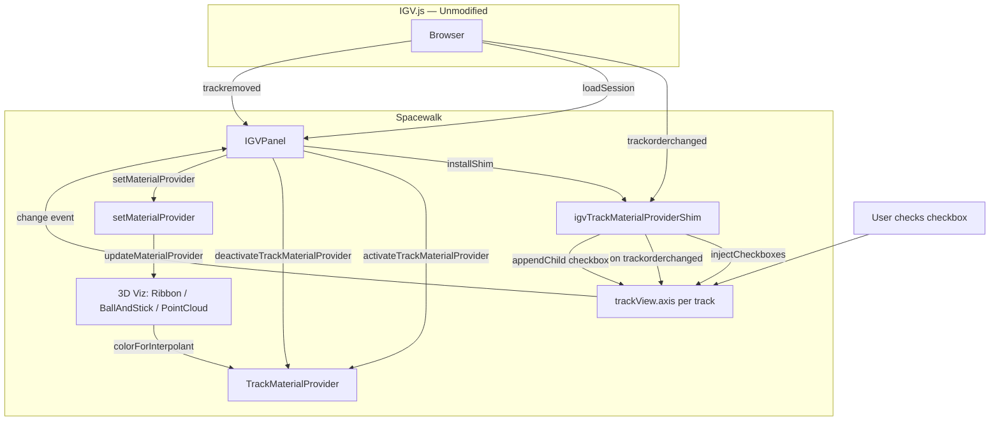
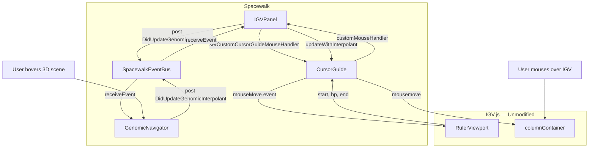
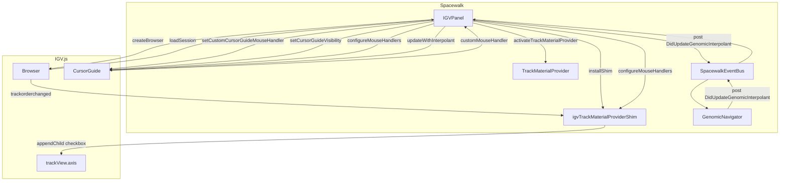
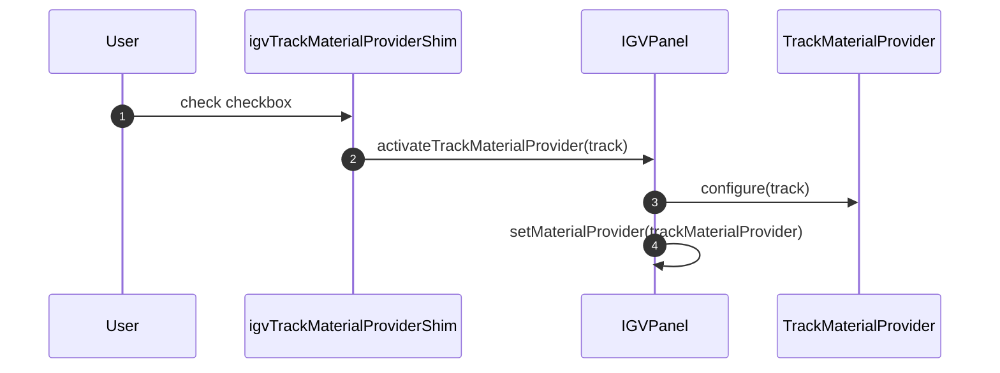
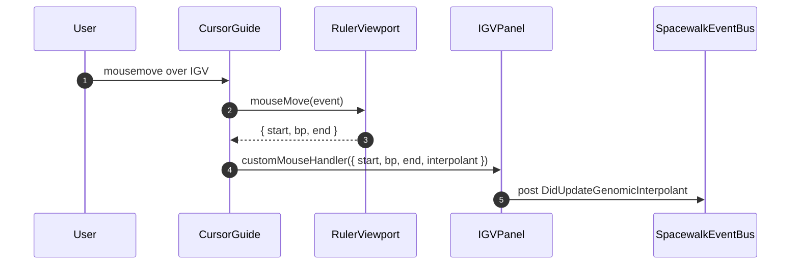
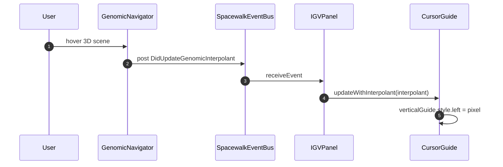

# Spacewalk ↔ IGV.js Interaction Diagrams

Interaction flows for the track material provider (checkbox) and cursor guide features. Spacewalk embeds IGV.js and coordinates via its public API; no IGV modifications required.

---

## 1. Track Material Provider — Architecture

Spacewalk injects checkboxes into IGV's axis column via a shim. When IGV rebuilds (loadSession, track reorder), the DOM is torn down—Spacewalk re-injects on those events.

### Key Points

| Aspect | Detail |
|--------|--------|
| **Injection point** | `trackView.axis` (axis column per track) |
| **Re-injection triggers** | After `createBrowser`, after `loadSession`, on `trackorderchanged` |
| **State persistence** | `track.embeddingCheckboxChecked` for session restore |
| **Excluded track types** | ruler, sequence, ideogram |

---

## 2. Cursor Guide — Architecture

Bidirectional sync: IGV mouse position → 3D scene, and 3D scene hover → IGV cursor position. Spacewalk configures handlers and re-applies visibility after IGV rebuilds.

### Key Points

| Aspect | Detail |
|--------|--------|
| **IGV → Spacewalk** | `setCustomCursorGuideMouseHandler` callback receives `{ start, bp, end, interpolant }` |
| **Spacewalk → IGV** | `cursorGuide.updateWithInterpolant(t)` (spacewalk branch only; guarded on master) |
| **Re-apply triggers** | After `createBrowser`, after `loadSession` (in `configureMouseHandlers`) |
| **Master workaround** | `doShowCursorGuide = true` so `rulerViewport.mouseMove` returns a value |

---

## 3. Combined Architecture — Both Features

---

## 4. Sequence Diagrams (Reference)

### Track Material Provider — Sequence

### Cursor Guide — Sequence (IGV → Spacewalk)

### Cursor Guide — Sequence (Spacewalk → IGV)

