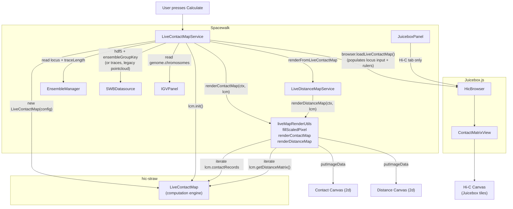
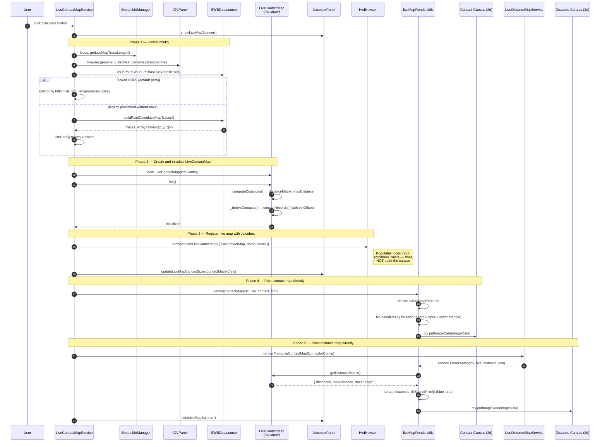
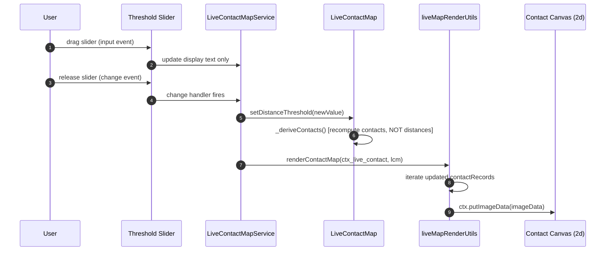
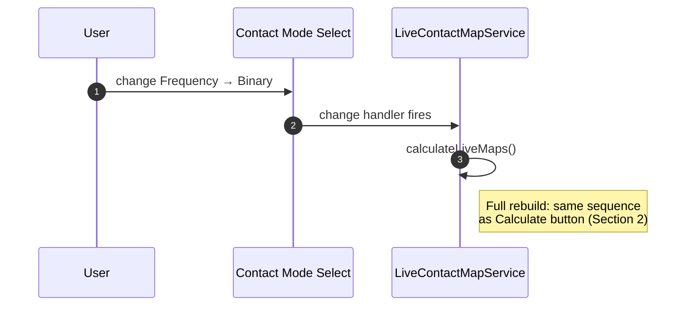
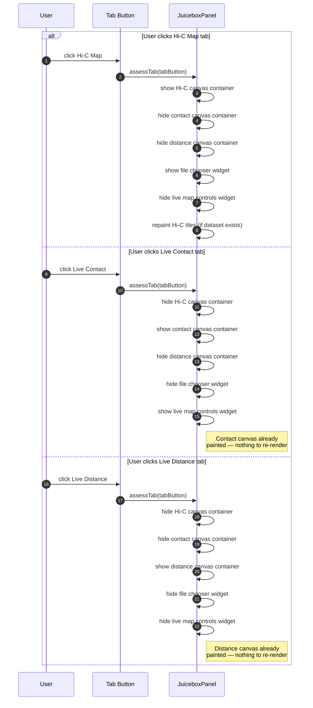
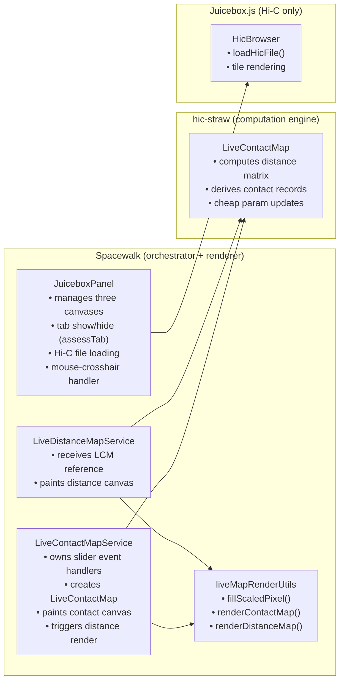
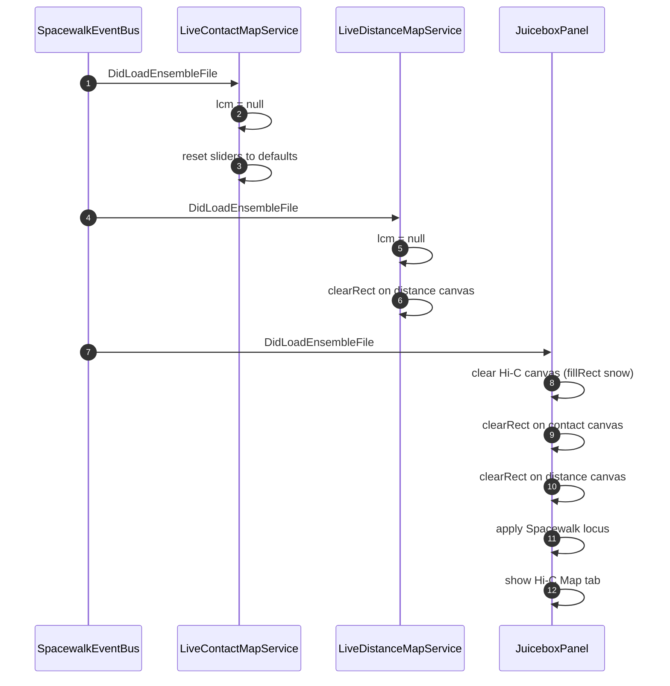

# Spacewalk ↔ Juicebox.js Interaction Diagrams

Interaction flows for the redesigned Juicebox panel. Live contact maps and live distance maps are computed by **hic-straw's `LiveContactMap`** and rendered by **direct canvas painting** — the same simple approach used in hic-straw's own example page. Juicebox's tile pipeline is used **only** for static Hi-C maps.

> **Updated 2026-06.** Reflects current `LiveContactMap` setup: hic-straw receives the open HDF5 handle directly (baked `live_contact_map_vertices` fast path) and only falls back to runtime trace gathering for legacy pointcloud files. The old `liveMapUtils.ensureLiveMapVertexLists()` / `EnsembleManager.getLiveMapVertexLists()` indirection is gone. Also reflects Phase 3 DI (PR #44): `JuiceboxPanel`, `LiveContactMapService`, and `LiveDistanceMapService` all receive their collaborators via constructor injection; the module-level `tabAssessment` helper was folded into `JuiceboxPanel.assessTab()`.

---

## 1. Architecture Overview

Three tabs, **three separate canvases**, one rendering approach per map type:

| Tab | Canvas | Rendering | Owned by |
|-----|--------|-----------|----------|
| **Hi-C Map** | Juicebox main canvas | Juicebox tile pipeline | Juicebox.js |
| **Live Contact** | Spacewalk contact canvas (`ctx_live_contact`, 2d) | Direct `putImageData` painting | Spacewalk |
| **Live Distance** | Spacewalk distance canvas (`ctx_live_distance`, 2d) | Direct `putImageData` painting | Spacewalk |

Each tab shows its own canvas. No dataset swapping. The Hi-C tab is completely independent from the two live map tabs.

Both live maps are painted using the same pattern from hic-straw's `examples/live-contact-map.html`: iterate data, call `fillScaledPixel()` for each bin, `putImageData()`. Simple, fast, no tile pipeline overhead.



---

## 2. Calculate Button — Full Sequence

When the user presses **Calculate**, a single `LiveContactMap` instance is created. Both maps are painted directly to their respective canvases. Juicebox is not involved.



### Key Points

| Aspect | Detail |
|--------|--------|
| **Single LCM instance** | One `LiveContactMap` serves both maps — contact records for the contact canvas, distance matrix for the distance canvas |
| **Direct painting** | Both canvases use `getContext('2d')` → `getImageData` → `fillScaledPixel` → `putImageData`. No tile pipeline, no Straw, no HiCDataset |
| **HDF5 fast path** | Spacewalk passes hic-straw the already-open HDF5 handle so it can use the baked `live_contact_map_vertices` dataset. Legacy pointcloud files without the bake fall back to runtime centroid collapse via `ds.buildPointCloudLiveMapTraces()` |
| **Juicebox register-only** | `browser.loadLiveContactMap()` is called so Juicebox populates the locus input, scrollbars, and rulers — but the canvas itself is painted directly by Spacewalk, not by the tile pipeline |
| **Rendering utilities** | `liveMapRenderUtils.js` provides `renderContactMap()`, `renderDistanceMap()`, and `fillScaledPixel()` — shared by both services |
| **Bin offset** | `renderContactMap()` uses `lcm.binOffset` to convert absolute bin indices back to trace-relative canvas positions |

---

## 3. Slider Adjustment — Cheap Parameter Update

Adjusting the **threshold** or **exclusion** slider re-derives contact records from the existing distance matrix, then repaints the contact canvas directly. No Juicebox involvement.



### Cost Comparison

| Operation | What it computes | Cost |
|-----------|-----------------|------|
| **Calculate button** | Distance matrix + contact records + paint both canvases | Expensive (O(traces x N^2)) |
| **Threshold / Exclusion slider** | Contact records only (from existing distance matrix) + repaint contact canvas | Cheap (O(N^2)) |
| **Contact mode change** | Full rebuild (new LCM + init + paint both canvases) | Expensive (same as Calculate) |

---

## 4. Contact Mode Change — Full Rebuild

Switching between **Frequency** and **Binary** contact modes requires a full rebuild because the derivation algorithm differs fundamentally.



---

## 5. Tab Switching — Three Separate Canvases

Each tab simply shows/hides its own canvas container. No dataset swapping, no Juicebox API calls for live tabs.



### Canvas and Widget Visibility

| Tab | Hi-C Canvas | Contact Canvas | Distance Canvas | File Chooser | Controls |
|-----|-------------|----------------|-----------------|--------------|----------|
| Hi-C Map | visible | hidden | hidden | visible | hidden |
| Live Contact | hidden | visible | hidden | hidden | visible |
| Live Distance | hidden | hidden | visible | hidden | hidden |

---

## 6. Component Responsibilities



| Component | Lives in | Owns |
|-----------|----------|------|
| `LiveContactMap` | hic-straw | Distance matrix, contact records, cheap param updates |
| `LiveContactMapService` | Spacewalk | Slider UI, Calculate button, LCM lifecycle, contact canvas painting |
| `LiveDistanceMapService` | Spacewalk | Distance canvas painting |
| `liveMapRenderUtils` | Spacewalk | `fillScaledPixel()`, `renderContactMap()`, `renderDistanceMap()` |
| `JuiceboxPanel` | Spacewalk | Three canvas containers, tab switching, Hi-C file loading |
| `HicBrowser` | Juicebox.js | Hi-C tile pipeline only |

---

## 7. Ensemble Lifecycle — DidLoadEnsembleFile

When a new ensemble loads, all three components reset independently via the event bus.



---

## 8. Data Flow Summary

```
Ensemble 3D structures
        │
        ▼
SWBDatasource — hdf5 handle (baked live_contact_map_vertices)
                or buildPointCloudLiveMapTraces() (legacy pointcloud)
        │
        ▼  hdf5 + ensembleGroupKey  OR  traces: Array<Array<{x, y, z}>>
        │
   LiveContactMap (hic-straw)
        │
        ├──── init()
        │       ├── _computeDistances()  →  distanceMatrix (Float32Array)
        │       └── _deriveContacts()    →  contactRecords[] (with binOffset)
        │
        ├──── contactRecords            ─────►  renderContactMap()    →  contact canvas (2d)
        │     (iterated directly by                                      putImageData
        │      liveMapRenderUtils)
        │
        ├──── getDistanceMatrix()       ─────►  renderDistanceMap()   →  distance canvas (2d)
        │                                                                putImageData
        │
        ├──── setDistanceThreshold()    ───►  _deriveContacts() only (cheap)
        │                                     then renderContactMap() repaint
        │
        └──── setNeighborExclusion()    ───►  _deriveContacts() only (cheap)
                                              then renderContactMap() repaint
```

---

## 9. What Changed from the Previous Design

| Aspect | Before (original) | Middle (first refactor) | Now (current) |
|--------|-------------------|------------------------|---------------|
| **Contact map rendering** | Web worker RGBA + bitmaprenderer | Juicebox tile pipeline | Direct 2d canvas painting |
| **Distance map rendering** | Web worker RGBA + bitmaprenderer | Spacewalk RGBA + bitmaprenderer | Direct 2d canvas painting |
| **Canvases** | 3: Hi-C, ctx_live, ctx_live_distance | 2: Juicebox main (shared), distance | 3: Hi-C, contact (2d), distance (2d) |
| **Juicebox involvement** | Color scale only | Full tile pipeline for contacts | `loadLiveContactMap()` to register locus/rulers only; Hi-C tile pipeline for Hi-C files only |
| **Tab switching** | Separate canvases | Dataset swap on shared canvas | Separate canvases, show/hide via `JuiceboxPanel.assessTab()` |
| **Canvas context type** | bitmaprenderer | bitmaprenderer + Juicebox ctx | All 2d (getContext('2d')) |
| **Rendering pattern** | Custom per-pixel RGBA loops | Tile pipeline + custom RGBA | `fillScaledPixel` + `putImageData` |
| **Threshold/exclusion** | Spacewalk auto-detect | Sliders → repaintMatrix() | Sliders → renderContactMap() |
| **Worker files** | liveContactMapWorker, liveDistanceMapWorker | Deleted | Deleted |
| **Shared utility** | None | None | `liveMapRenderUtils.js` |
| **Vertex data path** | Computed per-call from EnsembleManager | `liveMapUtils.ensureLiveMapVertexLists()` indirection | Baked `live_contact_map_vertices` HDF5 fast path; legacy fallback via `ds.buildPointCloudLiveMapTraces()` |
| **Module wiring** | Singleton imports from `app.js` | Singleton imports from `app.js` | **Constructor injection** (PR #44): `JuiceboxPanel`/`LiveContactMapService`/`LiveDistanceMapService` all receive collaborators explicitly. `tabAssessment` + `juiceboxMouseHandler` folded into `JuiceboxPanel` methods; `juiceboxPanelInstance` module singleton deleted |
